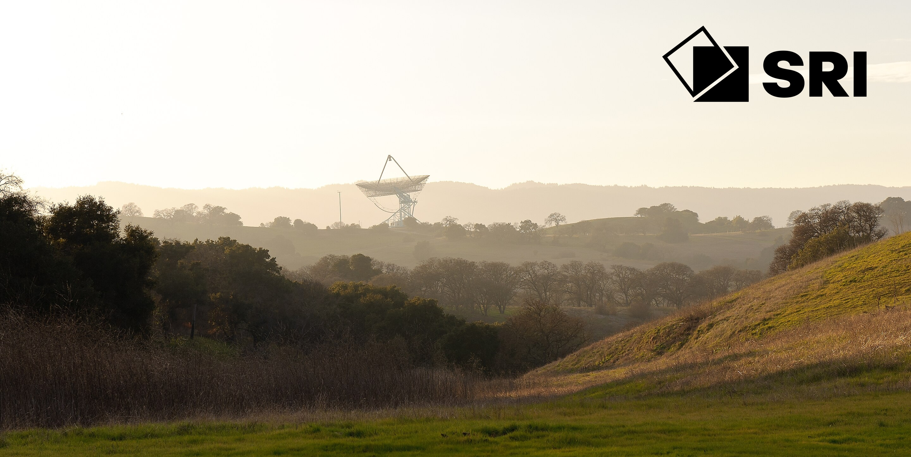

# Formal Methods Program

For over 60 years, the Computer Science Lab at SRI has been pivotal in the founding, theory, and practice of
formal methods, fault-tolerant computing, and the development of high-assurance software.

See [Impact](/impact) for a detailed portfolio.

## Latest News
 - [06/2025] Yices2 submitted to SMT-COMP 2025!
 - [06/2025] [PVS Day @ NASA Formal Methods 2025](https://shemesh.larc.nasa.gov/nfm2025/pvs-day.html)
 - [05/2025] [Fourteenth Summer School on Formal Techniques](https://ssft-sri.github.io/) @ Menlo College
 - [05/2025] _Boosting MCSat Modulo Nonlinear Integer Arithmetic via Local Search_ accepted to CADE-30!
 - [04/2025] _Decision Heuristics in MCSat_ accepted to CAV 2025!
 - [??/2024] SRI has been awarded a contract by ARPA-H (under the PARADIGM effort) to develop a mobile healthcare platform that improves  healthcare access and health outcomes across rural America.
 
